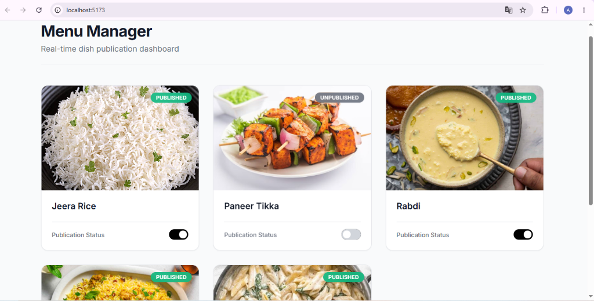
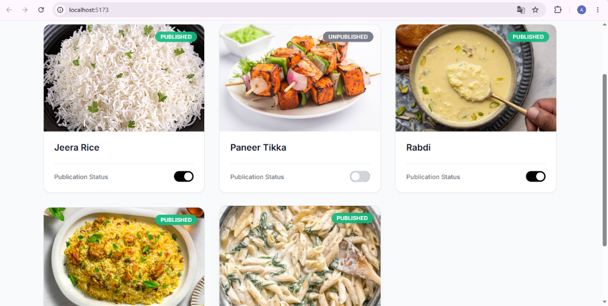

# Menu Manager Dashboard



A production-grade full-stack web application designed to manage dish publication statuses. It features an aesthetic, clean white UI inspired by top-tier tech companies and robust real-time updates.

## Features

- **Beautiful White Aesthetic UI**: Built with React and pure CSS, focusing on micro-animations, generous whitespace, and elegant shadows.
- **Real-Time Updates**: Instantly reflects publication toggles across all connected clients using `Socket.IO`.
- **Backend Database Polling**: Directly modifying the SQLite database (out-of-band updates) will still trigger real-time updates on the frontend, ensuring true data synchronization.
- **Production-Grade Backend**: Built with Express.js and Prisma ORM for robust data management and typing.
- **Zero Configuration DB**: Embedded SQLite database that seeds automatically on startup.

## Technologies Used
- **Frontend**: React.js, Vite, Socket.io-client, Vanilla CSS
- **Backend**: Node.js, Express.js, Socket.IO, Prisma ORM, SQLite

## Setup Instructions

### 1. Start the Backend
Open a terminal in the `backend` folder and run:
```bash
npm install
npm run dev
```
*(The server will start on `http://localhost:3001` and the database will be automatically seeded with the initial dishes if it's empty.)*

### 2. Start the Frontend
Open a new terminal in the `frontend` folder and run:
```bash
npm install
npm run dev
```
*(The React application will start. Open your browser to the local URL provided, typically `http://localhost:5173`.)*

## Verifying Real-Time Updates
1. Open the dashboard in two different browser windows side-by-side.
2. Toggle the publication status of a dish in one window.
3. Observe the change instantly reflecting in the other window without a refresh.
4. **Advanced**: You can also use an API tool like Postman or `curl` to make a `PATCH` request to `http://localhost:3001/api/dishes/1/toggle`. The dashboard will automatically update to reflect this direct backend change!
